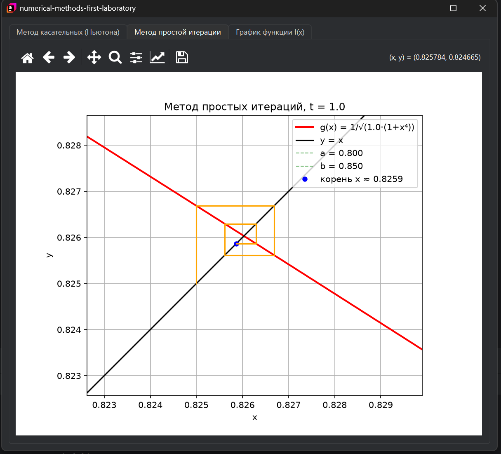
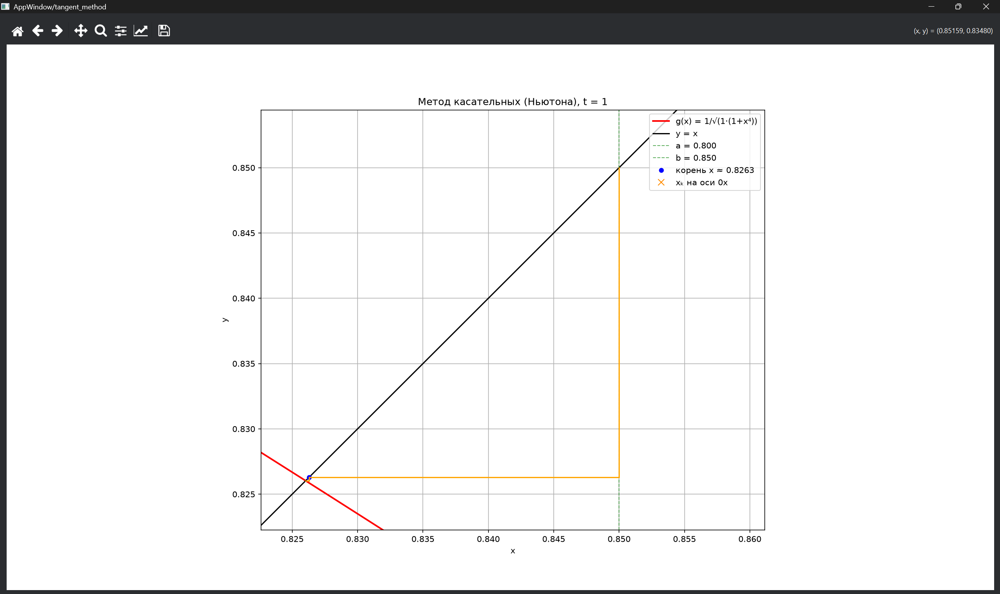

# Лабораторная работа №1 по численным методам решения инженерных задач
## Решение трансцендентных уравнений методом простых итераций и методом касательных (Ньютона)
___
### Для работы программы необходимо:
- **Python 3.11+**
- **Windows 10(11)**
---
### Решение методом простых итераций

### Решение методом касательных (Ньютона)

